# Ures

🚀 Overview
-----------

The **Ures** app is a powerful real estate CRM companion designed to help sales agents and brokers streamline tasks efficiently on mobile. Leveraging **Kotlin Multiplatform Mobile (KMP)**, Ures provides a seamless experience across both Android and iOS, ensuring smooth management of leads, properties, and sales activities anytime, anywhere.

🌟 Key Features
---------------

*   **📇 Lead Management**: Easily track, follow up, and manage client interactions.
*   **🏠 Property Listings**: Access and update real-time property information.
*   **📅 Task & Calendar Integration**: Stay on top of important appointments and deadlines.
*   **🔔 Notifications & Reminders**: Never miss a follow-up or key event.
*   **📊 Sales Analytics**: Gain insights into sales performance and lead conversion.
*   **💬 Team Collaboration**: Communicate with colleagues and share updates effortlessly.
*   **🌐 Multi-Language Support**: Cater to diverse clientele with multilingual capabilities.
*   **🔒 Secure Access**: Protect sensitive data with biometric authentication.
*   **🎛️ Customizable Settings**: Adjust the app to match your workflow and preferences.

🛠️ Technologies Used
---------------------

*   **Kotlin Multiplatform Mobile (KMP)**: Unified codebase for Android and iOS.
*   **Jetpack Compose**: Modern UI toolkit for building sleek and responsive Android interfaces.
*   **MVI Architecture**: Predictable state management for scalable development.
*   **Ktor**: Efficient networking for API communication.
*   **KotlinX Serialization**: Seamless data handling and serialization.
*   **Coil**: Fast and lightweight image loading.

📸 Screenshots
--------------

Showcasing the app’s user-friendly interface and robust feature set:

    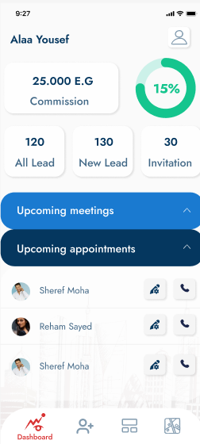
    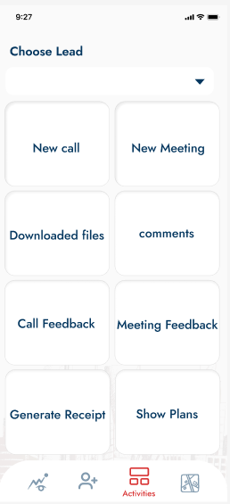
    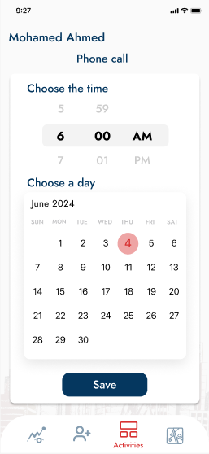
    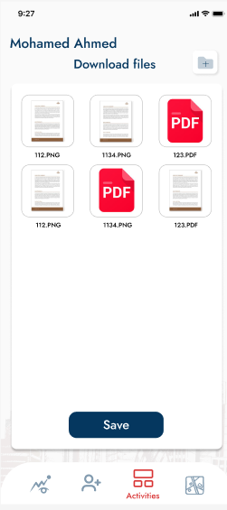
    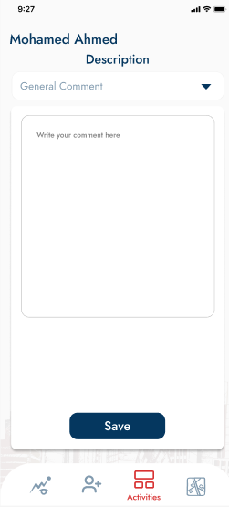
    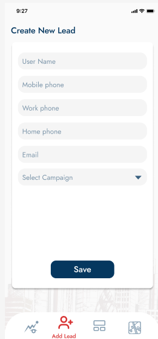
    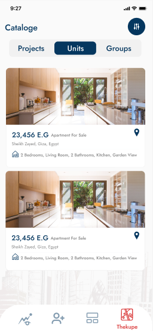
    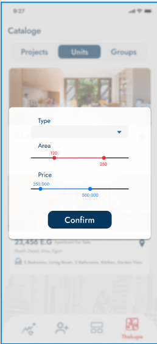
    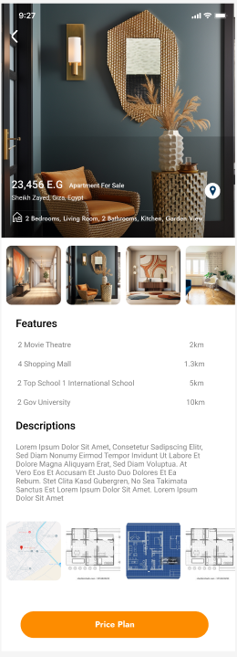
    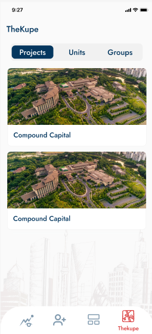
    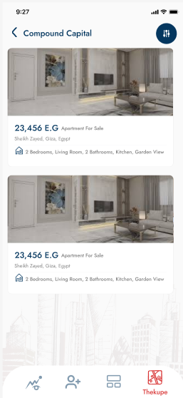
    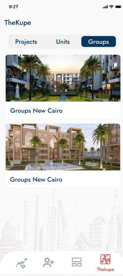
    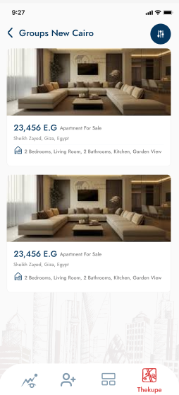
    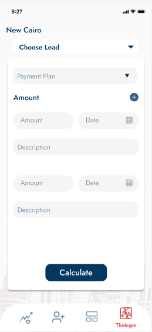
    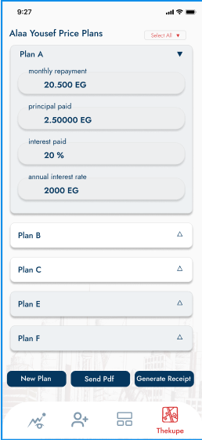
    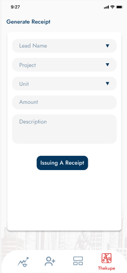
    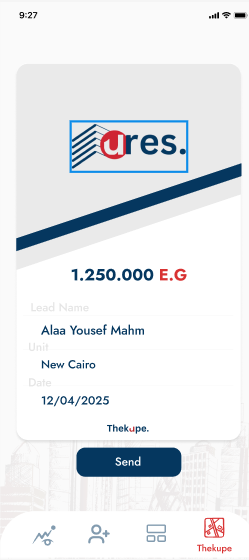

📬 Contact
----------

For inquiries, feature requests, or support, reach out to the project maintainers. at 

---

Feel free to tweak the text to align with your branding and messaging!

